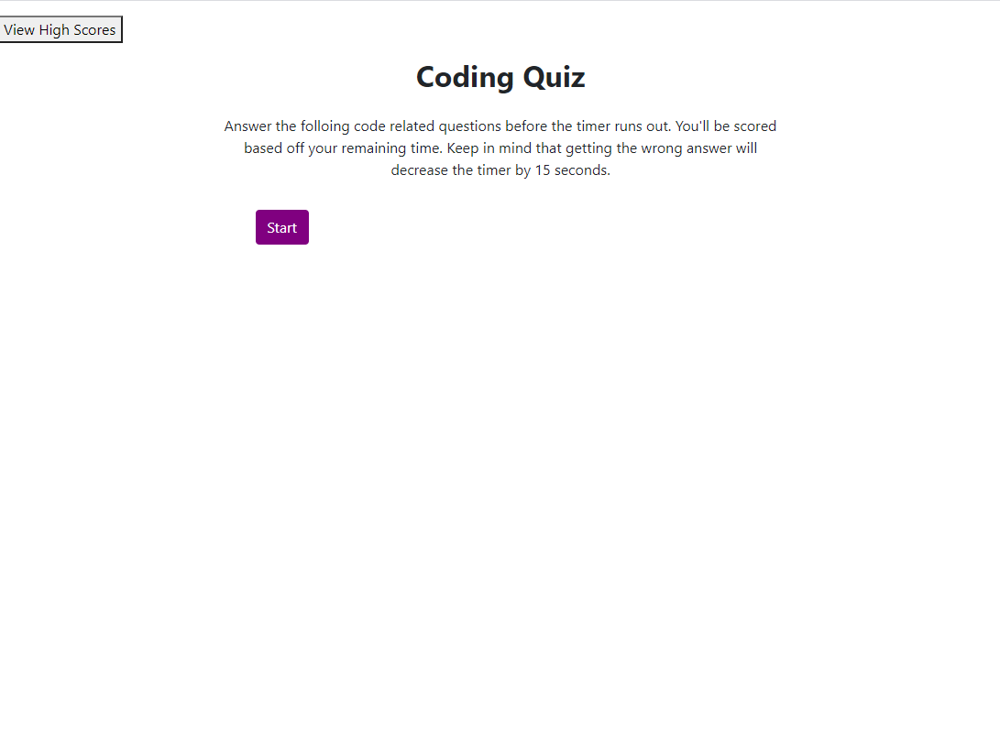
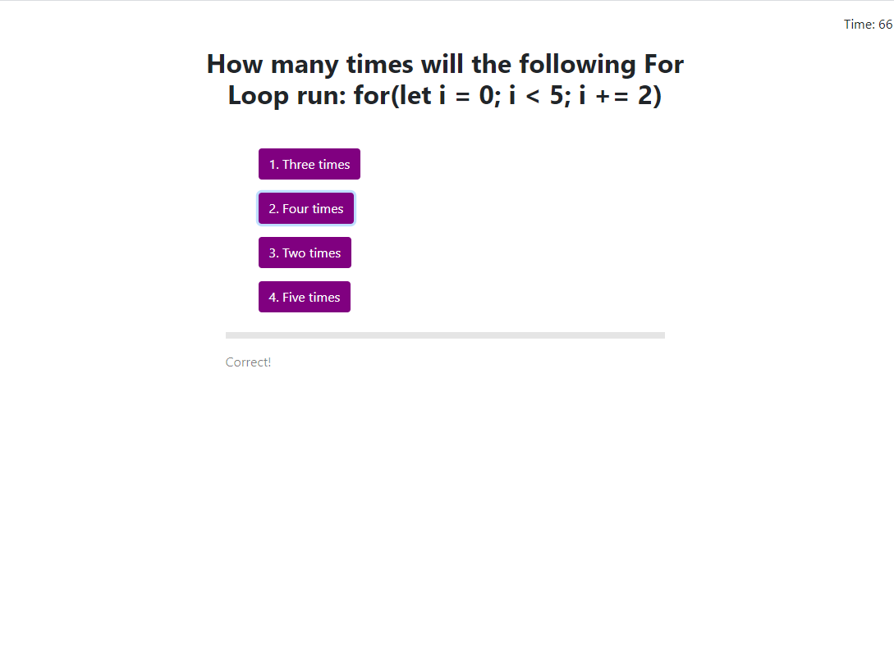
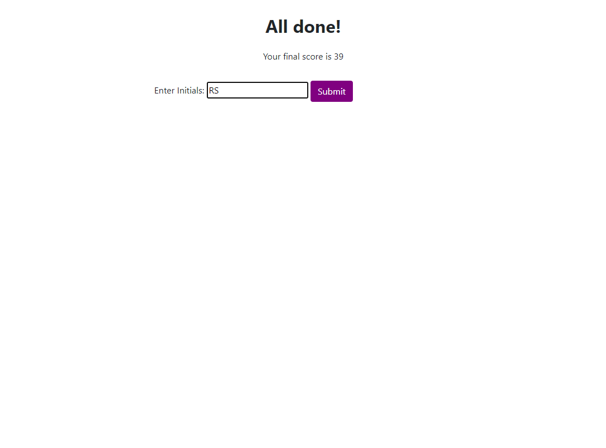
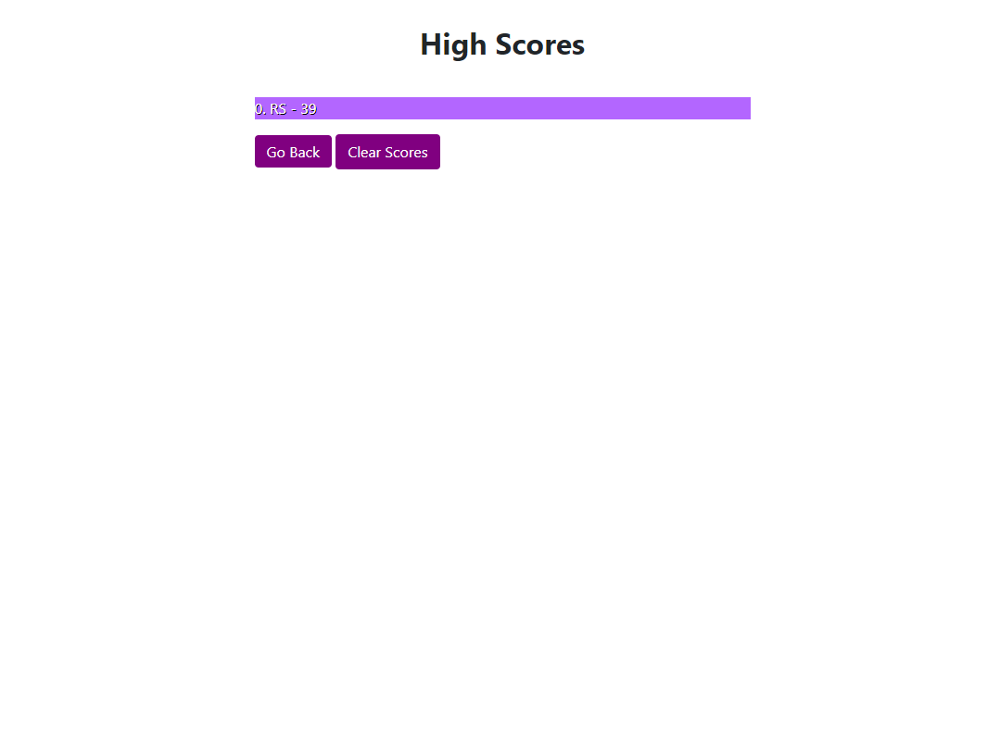

### QuizTime
Simple coding quiz that asks you 5 coding related questions in random order.

You have 75 seconds to respond to all of them and getting any question wrong will deduct 15 seconds from your time. 

At the end, your score will be determinded by the amount of time you have left and you'll be asked to give your initals.

Your highscore will be displayed to you and saved in your local storage so that you can see it any time.
